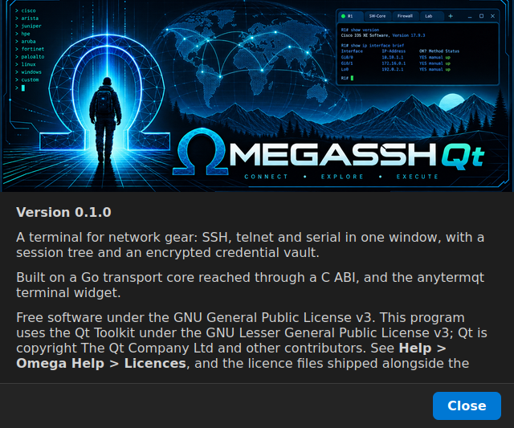
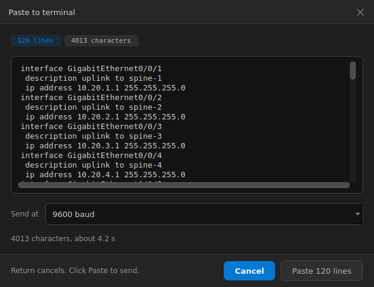
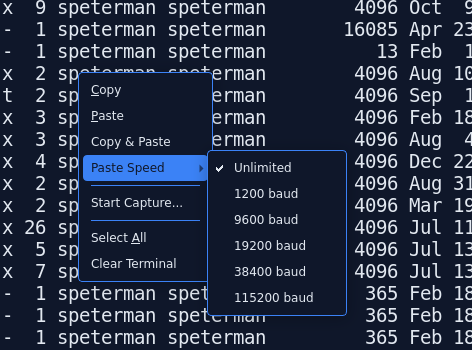

# omegassh

A session core for native applications — SSH, telnet and serial. Go
underneath, C ABI in the middle, Qt on top.




### see releases: 

| | |
|---|---|
| macOS (Apple Silicon) | `Omega-mac-0.1.0-arm64.zip` |
| Windows (x64) | `omega-windows-x64.zip` |
| Linux (x86-64) | `omega-0.1.0-linux-x86_64.AppImage` |

**None of these are signed with a certificate anybody's operating system
trusts.** They are ad-hoc signed on macOS and unsigned on Windows, because a
Developer ID and a code signing certificate are annual costs this project has
not taken on. Each platform objects in its own way, and macOS objects in a way
that sounds like the download is broken when it is not.

**macOS.** Unzip, move `Omega.app` to `/Applications`, then clear the quarantine
attribute the browser attached:

```bash
xattr -dr com.apple.quarantine /Applications/Omega.app
```

Without that you get *"Omega is damaged and can't be opened"*, which is
Gatekeeper's wording for an ad-hoc signature on a quarantined file rather than a
statement about the download. Right-click → Open does not reliably clear it on
current macOS.

**Windows.** Right-click the zip → Properties → **Unblock** before extracting,
or every DLL inside inherits the mark-of-the-web and the application fails to
start. Then run `omega.exe`; SmartScreen will warn about an unknown publisher,
and *More info → Run anyway* gets past it. If it will not start at all, the
folder includes `vc_redist.x64.exe` for machines without the MSVC runtime.

**Linux.** `chmod +x Omega-0.1.0-x86_64.AppImage` and run it. If your
distribution has no FUSE, `./Omega-0.1.0-x86_64.AppImage --appimage-extract-and-run`
works without it.

Or build from source, which avoids all of the above — see
[Building](#building).


omegassh turns a network device into a byte stream. It does not draw
anything. [anytermqt](https://github.com/scottpeterman/anytermqt) draws
bytes and does not connect to anything. Together they are a terminal; apart
they are each small enough to finish.

```cpp
omegassh::Config cfg;
cfg.host = "eng-leaf-1.lab.local";
cfg.username = "labadmin";
cfg.privateKeyPath = "~/.ssh/id_ed25519";
cfg.hostKeyPolicy = omegassh::HostKeyPolicy::Tofu;
cfg.legacyAlgorithms = true;          // for gear that predates the good ciphers

auto *terminal = new qtpyte::TerminalWidget(this);
auto *session  = new omegassh::OmegaSshSession(this);

omegassh::attach(terminal, session);   // the same three connections
                                       // qtpyte::attach makes

// start() does not wait for the far end. It returns as soon as the config
// has been checked, and the connect reports itself here.
connect(session, &omegassh::OmegaSshSession::stateChanged,
        this, &MyTab::showOverlay);    // connecting, authenticating, connected
connect(session, &omegassh::OmegaSshSession::errorOccurred,
        this, &MyTab::showError);      // ...or why it did not get there

session->start(cfg);
```

That is the whole integration. No threads, no marshalling, no buffering.
`OmegaSshSession` carries the same signal names as anytermqt's `PtySession` —
`dataReceived`, `write`, `resize`, `terminate`, `finished(int)` — so the
widget cannot tell whether it is driving a local shell or a router two
continents away.

The dial runs behind `start()` rather than inside it, so it is safe on the GUI
thread — which is the point, since a connection overlay cannot paint on a
thread that is blocked dialing. `start()` returning `true` means the dial
began; whether it *landed* arrives on `stateChanged`.

## What it does

- SSH transport with pty allocation, window resizing and exit detection
- Auth chain: agent → public key → password → keyboard-interactive
- Jump hosts, with the **same** algorithm policy on both hops
- Host-key policy as an explicit choice: strict, TOFU, or insecure
- A legacy algorithm tail for gear that only speaks `group1-sha1` and CBC
- known_hosts that tolerates a malformed line instead of failing every
  connection because of it
- Telnet, with the negotiation handled so it never reaches the emulator as
  garbage: console servers, reverse-telnet console ports, gear with no SSH
  stack at all
- Serial, including port enumeration, so a quick-connect form does not need
  `QSerialPort` in the build for the sake of a list of strings
- Session logging tapped below the emulator, so it works the same on all
  three transports
- A dial that never blocks its caller, publishing connecting → authenticating
  → connected as it goes, so a connect against gear that is switched off looks
  different on screen from one against gear that refused a password

One transport interface underneath all of it: `read`, `write`, `resize`,
`alive` and `close` mean the same thing whichever is open, and the choice is
made once at `start`. The same goes for how a session reports itself — one
state vocabulary and one event queue — except that no transport fakes a state
it cannot reach. Telnet never reports authenticating, because the protocol has
no authentication step; serial reports neither connecting nor authenticating,
because opening the port is the whole handshake.

Telnet is never a fallback from a failed SSH connection. That would silently
downgrade a session the operator believed was encrypted.

## Omega, the application

The repo now also builds the application the library was extracted for.
`omega` is a Qt terminal — session tree, tabs, themes, credentials — with no
Python in the process. It is the nterm-qt lineage rebuilt natively, and
[ROADMAP.md](ROADMAP.md) is explicit about what it will and will not grow into.

What runs today, confirmed against real hosts on Linux, Windows and macOS:

- **A session tree** over `~/.nterm/sessions.db` — folders, drag to reorder and
  reparent, a filter, and a context menu that connects, edits, duplicates and
  deletes. Double-click connects in a tab.
- **Saved sessions over SSH, telnet or serial**, with per-session overrides for
  term type, scrollback, paste threshold and rate, host key policy, legacy
  algorithms, anti-idle and a jump host. Anything a session does not say is
  inherited from the global settings and keeps following them — see
  [docs/SESSION-ATTRIBUTES.md](docs/SESSION-ATTRIBUTES.md).
- **A session editor** — identity and filing, the transport and its target, the
  terminal and paste settings, and the SSH and jump-host rows.
- **Import and export** of TerminalTelemetry `sessions.yaml`, on Ctrl+I and
  Ctrl+E.
- **Credential management** — a vault unlock dialog and a credential manager
  that adds, edits, renames, disables and sets a default. Sessions reference a
  credential by NAME; the material is read on the Go side during the dial and
  never crosses back.
- **Quick connect** — a dialog that opens an SSH, telnet or serial session in
  a tab, with the serial form populated from the real port enumerator.
- **A terminal tab that behaves like one** — a connection overlay with a
  Cancel button while the dial is actually in flight, a host-key prompt on
  first contact, a context menu (reconnect, copy, paste, copy & paste, paste
  speed, capture, select all, clear), session capture to a log, paste
  confirmation above a line threshold, rate-limited paste in **baud**, and Tab
  reaching the far end instead of the focus chain.
- **A tab bar that closes in bulk** — right-click for close, close others,
  close to the right, close all, warning once and naming the sessions when any
  of them is still connected.
- **Reconnect in place** — a tab whose session ended re-dials the same config
  in the same tab, so the scrollback underneath survives.
- **A settings dialog and anti-idle**, writing both `~/.nterm/config.json` and
  Omega's own `~/.nterm/omega.json`.
- **Help and About** — F1 for a topic window covering every session option and
  everything kept on disk.
- A window that remembers its geometry, and all 33 themes switching live.

What does not exist yet: detached windows, debouncing the resize, and a "Save
as session" route out of quick connect. Import and export cover the
TerminalTelemetry format only — the CSV and JSON formats are still Phase 8.

### Paste, at the speed of the far end

Paste is the one place a terminal can lose characters silently. Forty lines
into a console port with no flow control arrive short, and nothing says so.



The confirmation appears above a configurable line threshold — default 1, as
in nterm-qt, which is deliberate for network gear — and it is where the rate
gets chosen, because that is where the block is on screen and the estimate can
say what the choice costs. Baud rather than a millisecond delay: baud is the
number already known about the far end, printed on the device rather than
guessed at. Serial defaults to the port's own baud, telnet to 9600, SSH is
unpaced. Escape cancels a paste in flight.



The Paste Speed submenu covers pastes too short to raise a confirmation. It
applies to the tab in front of you; the persisted form is the session's own
paste rate, which is a column rather than a setting because the rate that
matters is a property of the far end.

```bash
./build/app/omega
```

The application does not change the library's shape. `app/` links `omega::theme`,
`omega::settings`, `omegassh::qt` and anytermqt, and nothing below the C
boundary knows it exists.

## What it does not do

Terminal emulation, session management, discovery. Those belong to the
application — which now lives in `app/`, in this repo, as a consumer of the
library like any other. Keeping the *library* narrow is the point.

Credential storage is here despite the above, for a mechanical reason — two
Go c-archives cannot link into one process — and `include/omegassh/vault.h`
opens by explaining itself.

## Layout

```
sshcore/      the SSH work — plain Go, importable on its own
telnetx/      the telnet transport, carried over from PathfinderSSH
serialx/      the serial transport, likewise
transport/    the contract all three satisfy: states, events, logging tap
vault/        credential storage — see include/omegassh/vault.h for why
capi/         cgo shim, marshalling only
sessions/     the session store, C++ and SQLite
theme/        the theme system and the 33 theme files, shared with nterm-qt
app/          Omega itself — settings, the window, the terminal tab
include/      the hand-written stable C headers
qt/           OmegaSshSession — QObject wrapper, QtCore only
integration/  omegassh::attach and the theme→widget joint, header-only
examples/     C harnesses and three Qt examples
tests/        throwaway sshd, a fake telnet server, and the compat suites
docs/         DESIGN.md, BUILDING.md, VERIFIED.md, WINDOWS.md, phase notes
```


## Building

```bash
./scripts/build.sh                          # or scripts\build.bat on Windows
./scripts/build.sh --anytermqt ../anytermqt # + the app and the Qt examples
```

Needs Go 1.21+, CMake 3.19+, and Qt 6.2+ (Core only for the library —
`--no-qt` skips it). **The application additionally needs an anytermqt
checkout**, since a tab that dials needs a terminal widget to draw into;
without one, `omega`, `terminal_window` and `theme_gallery` are skipped and
everything else still builds.

Setting `NTERMQT_SRC` to an nterm-qt checkout turns on the three compatibility
suites — session store, themes, settings. They are skipped loudly rather than
quietly, because a green build that skipped them says nothing about whether
the two applications still agree.

To package rather than build:

```bash
./scripts/bundle-linux.sh    --anytermqt ../anytermqt   # relocatable tarball
./scripts/bundle-appimage.sh --anytermqt ../anytermqt   # single-file AppImage
./scripts/bundle-mac.sh      --anytermqt ../anytermqt   # Omega.app
scripts\bundle-windows.bat                              # folder + optional zip
scripts\bundle-windows-msix.bat --sign-self             # MSIX
```

Full per-platform detail — the mingw/MSVC split on Windows, the macOS bundle
ordering, what each packaging script verifies — is in
[docs/BUILDING.md](docs/BUILDING.md).

## Trying it

`tests/labsshd.sh` stands up a throwaway sshd on `127.0.0.1:2222` so the
examples have something real to talk to:

```bash
sudo ./tests/labsshd.sh start     # prints the commands to run
./build/examples/qt/qt_smoke 127.0.0.1 2222 labuser tests/.lab/clientkey
sudo ./tests/labsshd.sh clean
```

`tests/faketelnetd.py` does the same job for the telnet side, with no lab gear
and no root:

```bash
python3 tests/faketelnetd.py &                        # 127.0.0.1:2323
./build/examples/c/transport_probe 127.0.0.1 2323
```

And `tests/fakeconsole.py` for the serial side, over a socat pty pair — though
a pty proves the transport, not that a driver enumerates, so point this at a
real adapter when you have one:

```bash
socat -d -d pty,raw,echo=0,link=/tmp/omega-console \
            pty,raw,echo=0,link=/tmp/omega-device &
python3 tests/fakeconsole.py /tmp/omega-device &
./build/examples/c/transport_probe --serial /tmp/omega-console 9600
```

Run `transport_probe` with no arguments and it checks serial enumeration and
the refusal paths alone. The two session legs combine in one invocation.

With anytermqt available, the same three transports drive a real terminal
widget:

```bash
./build/examples/qt/terminal_window ssh    127.0.0.1 2222 labuser tests/.lab/clientkey
./build/examples/qt/terminal_window telnet 127.0.0.1 2323
./build/examples/qt/terminal_window serial /dev/ttyUSB0 9600
./build/examples/qt/terminal_window serial     # list ports and exit
```

One binary, not three. Exactly one function in that file knows which transport
is open; everything below it — the attach, the widget, the resize path, the
status bar, the teardown — is the same code for all three, which is the claim
Phase 2 is making.

The theme gallery renders every styled control against a chosen theme, which is
how a stylesheet regression gets caught before it is buried in the application:

```bash
./build/examples/qt/theme_gallery                 # live theme switching
./build/examples/qt/theme_gallery --shot shots    # one PNG per theme, no display
```

And the application itself:

```bash
./build/app/omega                                 # File > Quick Connect
./build/app/omega --themes theme/themes --config /tmp/omega.json
```

`--config` points it at a settings file that is not the real
`~/.nterm/config.json`, which is worth having while the two applications share
one.

## Status

Early, but exercised. Version 0.1.0.

**It runs on Linux, Windows and macOS**, and dials on all three — quick connect
opens a real SSH session in a tab, with `htop` rendering full-screen, which is
also the proof the resize connection is wired since a wrong NAWS shows up
nowhere else. Telnet and serial have run from the application's own dialog on
macOS; on Linux and Windows both are exercised through the C boundary.

**It packages on all three.** A macOS `.app` deployed with `macdeployqt`, a
relocatable Linux tarball, a single-file AppImage, a Windows folder deployed
with `windeployqt`, and an MSIX. The MSIX has been installed and run on a clean
Windows laptop with no Qt and no toolchain — vault credential and saved session
included — and `~/.nterm` is not redirected by package identity, so the store
stays shared with nterm-qt. Scripts and per-platform detail are in
[docs/BUILDING.md](docs/BUILDING.md).

**The theme system, settings layer, session store and TerminalTelemetry
importer are ports of nterm-qt's**, each verified against it by a differential
suite rather than by inspection — 233 checks over the themes, 19 over
`config.json`, 15 over the session store, 26 over the YAML reader and importer.
The session manager is the one place Omega deliberately diverges: a `QTreeView`
over a model rather than a `QTreeWidget`, so a drop is computed from the model
rather than from a view a filter may have emptied.

**Headless probes cover what reading the code cannot.**
`app/terminal_probe` runs 57 checks across eight groups offscreen — focus,
capture, paste pacing, host-key classification, anti-idle, scrollback, multi-tab
close and reconnect. `app/hostkey_flow_probe` needs the lab sshd and walks the
accept/reject/pinned sequences. `scripts/build.sh` runs both, skipping the
second loudly when nothing is listening.

Not written on the application side: detached windows, the resize debounce, and
the CSV and JSON halves of import. Not written in the library: Python bindings,
exec channels, Windows agent auth, keepalive. Interactive authentication has its
vocabulary defined and crosses to Qt as `interactionRequired`, but nothing emits
it yet — see Phase 2 in [ROADMAP.md](ROADMAP.md).

The legacy algorithm tail has not been tested against hardware that needs it.
Nothing is notarized or signed beyond ad-hoc and self-signed.

**[docs/VERIFIED.md](docs/VERIFIED.md) is the authority on what has and has not
been exercised**, per platform, with the caveats. This section is a summary and
will drift; that file is maintained as the record. Read it before trusting any
of the above.


## License
None - All Rights Reserved
 

